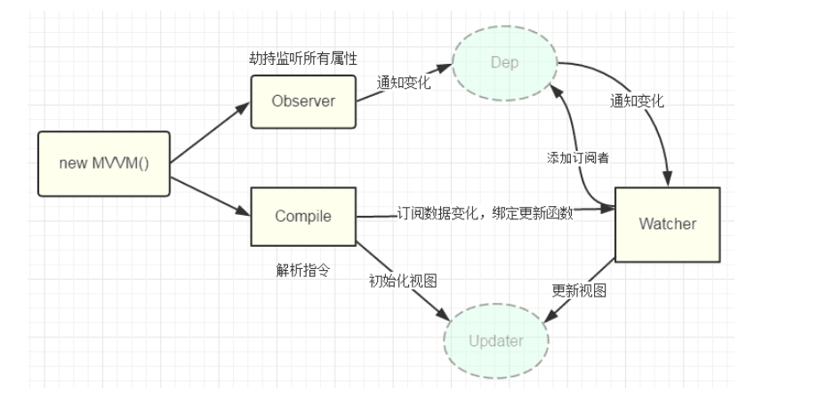

<!--
 * @Description: In User Settings Edit
 * @Author: your name
 * @Date: 2019-09-19 11:23:33
 * @LastEditTime : 2020-01-15 16:22:14
 * @LastEditors  : Please set LastEditors
 -->
#### 阅读vue源码笔记， 更多理解看代码中的注释(2.x版本) 


### 浏览器debug常用功能


引入数据检查 flow工具

 
new Vue 执行入口 src/core/index 


### 入口 src/core/instance/index.js  初始化Vue对象

初始化了一系列操作  E:\xuexi\vue\src\core\instance\init.js

### 初始化data数据
> 通过Object.defineProperty将data的key数据代理到vue对象的_data下，监听getter和setter  
E:\xuexi\vue\src\core\instance\state.js
initData 函数  
将data绑定在this._data 上
proxy 函数
Object.defineProperty 代理绑定 绑定在this的_data上

```js  
    initLifecycle(vm)  
    initEvents(vm)
    initRender(vm)
    //beforeCreate 之前执行了vue的一列表对象初始化操作
    callHook(vm, 'beforeCreate')
    initInjections(vm) // resolve injections before data/props
    initState(vm) //初始化data 做了一系列处理
    initProvide(vm) // resolve provide after data/props
    //created 之前执行了数据data，props的初始化操作
    callHook(vm, 'created')

```

### 数据响应式

总结一句话： 通过Observer(观察者)使用Object.defineProperty 劫持数据变得可以被监听变化，数据发生变更，通过Dep(观察订阅者管理中心) 依赖收集器通知Watcher(订阅者)更新虚拟dom树



1. 定义Observe实例， 在defineReactive将数据转化为可侦测（Object.defineProperty）
2. 通过Dep 收集（在Object.defineProperty 的get方法，收集依赖存入数组）界面上对数据的依赖（使用数据的元素）
3. Object.defineProperty set 方法侦听到界面对数据的操作，调用Dep.notice 方法通知依赖（watcher）更新虚拟dom树，界面完成更新 

 
Object.defineProperty的不足：
    无法检测数组的push，pop等变化，vue正对数组的push，pop等方法进行一次封装，在方法内加入了监听变化

Q: 为什么vue没有引入做到遍历数组下标加入响应系统？
A: 为了性能

### 模板解析 (/src/compiler)
> 在模板解析阶段主要做的工作是把用户在<template></template>标签内写的模板使用正则等方式解析成抽象语法树（AST）。而这一阶段在源码中对应解析器（parser）模块,将解析数据render到vdom中


### 虚拟dom （/src/core/vdom）

Q: 什么是虚拟DOM
所谓虚拟DOM，就是用一个JS对象来描述一个DOM节点，像如下示例：
```html
<div class="a" id="b">我是内容</div>

{
  tag:'div',        // 元素标签
  attrs:{           // 属性
    class:'a',
    id:'b'
  },
  text:'我是内容',  // 文本内容
  children:[]       // 子元素
}
```


虚拟DOM好处：使用JS的计算性能来换取操作DOM所消耗的性能

vue 虚拟DOM patch过程 
+ 创建节点：新的VNode中有而旧的oldVNode中没有，就在旧的oldVNode中创建。
+ 删除节点：新的VNode中没有而旧的oldVNode中有，就从旧的oldVNode中删除。
+ 更新节点：新的VNode和旧的oldVNode中都有，就以新的VNode为准，更新旧的oldVNode。

    
[https://nlrx-wjc.github.io/Learn-Vue-Source-Code/reactive/object.html#_4-%E4%BE%9D%E8%B5%96%E5%88%B0%E5%BA%95%E6%98%AF%E8%B0%81](https://nlrx-wjc.github.io/Learn-Vue-Source-Code/reactive/object.html#_4-%E4%BE%9D%E8%B5%96%E5%88%B0%E5%BA%95%E6%98%AF%E8%B0%81)
